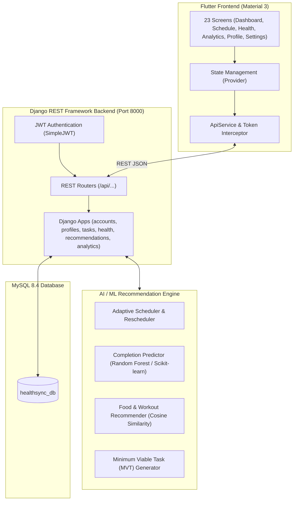

# HealthSync AI

**Personalized Health Monitoring, Adaptive Routine Planning and Intelligent Alert System**  
*Tagline: "A healthier day, intelligently planned around you"*

---

> [!IMPORTANT]
> **Medical Safety Disclaimer**: HealthSync AI is strictly a **personal wellness and healthy habit management system**, **NOT** a medical diagnosis or treatment platform. It never diagnoses diseases, prescribes medication, replaces medical professionals, or provides clinical treatment. All wellness metrics (e.g., Daily Wellness Score) and routine recommendations are non-medical habit optimizations.

---

## 🌟 Key Features

- 📱 **23 Flutter Material 3 Screens**: Clean, responsive, and accessible interface built with Flutter 3.47 and Dart 3.13.
- 🗓️ **Adaptive Routine Planning**: AI-driven daily routine generator that respects work/college focus blocks, sleep windows, and meal times.
- ⚡ **Minimum Viable Task (MVT) Engine**: Generates 10-minute fallback micro-habits on high-friction or busy days to preserve habit streaks.
- 🍱 **Content-Based Nutrition Recommender**: Vector space matching using Cosine Similarity for personalized meal suggestions with Indian & global dishes.
- 💡 **Explainable AI (XAI)**: Transparent *"Why this recommendation?"* justifications for every scheduled routine and nutritional item.
- 🧘 **Guided Mindfulness & Breathwork**: Interactive animated breathing countdown timer with Box Breathing and Body Scan sessions.
- 💧 **Hydration & Sleep Hub**: Visual hydration gauge with one-tap quick loggers and restorative sleep consistency tracking.
- 📊 **Weekly Adherence Analytics**: Interactive adherence bar charts (`fl_chart`) and holistic Daily Wellness Score trends.
- 🛡️ **Production-Grade Backend**: Django REST Framework backend with SimpleJWT authentication, role permissions, and MySQL 8.4 relational database.
- ⚙️ **Configurable API Endpoint**: Built-in runtime server configuration in Settings to switch between Localhost (`127.0.0.1:8000`), Android Emulator (`10.0.2.2:8000`), or LAN IPs.

---

## 🏗️ Architecture Overview



---

## 📂 Project Structure

```
HealthSyncAI/
├── ai_engine/                     # Standalone Python AI/ML Engine
│   ├── behavior_analysis.py       # User adherence and skip risk analysis
│   ├── exercise_recommender.py    # Workout recommendation & 10-min MVT generator
│   ├── food_recommender.py        # Cosine similarity nutrition recommender
│   ├── predict.py                 # Real-time task completion probability estimator
│   ├── preprocessing.py           # Feature engineering & encoding
│   ├── recommendation.py          # Explainable AI (XAI) coordinator
│   ├── scheduling.py              # Constraint-satisfaction daily routine scheduler
│   ├── train.py                   # Classifier training & model persistence
│   ├── models/                    # Serialized ML models (best_completion_model.joblib)
│   └── tests/                     # AI Engine unit tests
├── backend/                       # Django REST Framework Backend
│   ├── config/                    # Settings, master URLs, WSGI
│   ├── accounts/                  # Authentication & custom User model
│   ├── profiles/                  # HealthProfile, biometrics, preferences, availability
│   ├── tasks/                     # DailyTask and routine execution
│   ├── health_monitoring/         # Steps, sleep, water, and meditation logs
│   ├── nutrition/                 # Food database and macro distributions
│   ├── exercise/                  # Workout catalog and calorie estimators
│   ├── meditation/                # Mindfulness session templates
│   ├── recommendations/           # REST endpoints bridging to ai_engine
│   ├── notifications/             # User alerts & reminder notifications
│   ├── analytics/                 # Daily Wellness Score & adherence statistics
│   ├── .env                       # Local environment variables
│   └── manage.py                  # Django CLI
├── dataset/                       # Seed datasets (foods.json, exercises.json, behavior CSV)
├── documentation/                 # Comprehensive Technical Documentation
│   ├── architecture.md            # System architecture & component design
│   ├── database.md                # MySQL 8.4 schema & ER diagrams
│   ├── api.md                     # REST API contracts & endpoint specifications
│   ├── ai_methodology.md          # AI/ML algorithms, models & XAI methodology
│   └── testing.md                 # Complete verification guide & test results
└── frontend/                      # Flutter Mobile Application
    ├── lib/
    │   ├── core/                  # App colors, themes, API constants
    │   ├── providers/             # 7 ChangeNotifier providers
    │   ├── services/              # ApiService, AuthService, StorageService
    │   ├── screens/               # All 23 production screens + MainNavigationScreen
    │   └── main.dart              # MultiProvider & MaterialApp entrypoint
    ├── test/                      # Flutter widget tests
    └── pubspec.yaml               # Dependencies
```

---

## 🚀 Getting Started

### 1. Prerequisites
- **Python**: 3.11+ (Python 3.13 verified)
- **Flutter SDK**: 3.24+ (Flutter 3.47 verified)
- **MySQL**: 8.0+ (MySQL 8.4 verified on port 3306)

---

### 2. Backend Setup & Database Initialization

1. Navigate to the `backend/` directory:
   ```bash
   cd backend
   ```

2. Create and configure your `backend/.env` file:
   ```env
   SECRET_KEY=your-django-secret-key
   DEBUG=True
   ALLOWED_HOSTS=localhost,127.0.0.1,10.0.2.2,*
   DB_NAME=healthsync_db
   DB_USER=root
   DB_PASSWORD=your_password
   DB_HOST=127.0.0.1
   DB_PORT=3306
   JWT_ACCESS_TOKEN_LIFETIME_MINUTES=60
   JWT_REFRESH_TOKEN_LIFETIME_DAYS=7
   CORS_ALLOW_ALL_ORIGINS=True
   ```

3. Ensure MySQL is running and the database exists:
   ```sql
   CREATE DATABASE IF NOT EXISTS healthsync_db CHARACTER SET utf8mb4 COLLATE utf8mb4_unicode_ci;
   ```

4. Run migrations:
   ```bash
   python manage.py migrate
   ```

5. Train the AI model & seed initial datasets:
   ```bash
   python ../ai_engine/train.py
   python manage.py seed_healthsync
   ```

6. Start the development server:
   ```bash
   python manage.py runserver 0.0.0.0:8000
   ```
   Use `0.0.0.0` so phones and other devices on the same network can reach the backend. Allow Python through the Windows Firewall when prompted. Access OpenAPI documentation at `http://127.0.0.1:8000/api/docs/`.

---

### 3. Frontend Setup (Flutter)

1. Navigate to the `frontend/` directory:
   ```bash
   cd frontend
   ```

2. Fetch Flutter dependencies:
   ```bash
   flutter pub get
   ```

3. Run the Flutter client:
   ```bash
   flutter run
   ```
   *(Supports Windows Desktop, Web, Android Emulator, and iOS Simulator.)*

   For a physical phone on the same Wi-Fi network, replace `10.37.244.11` with the computer's IPv4 address:
   ```bash
   flutter run --dart-define=API_BASE_URL=http://10.37.244.11:8000
   ```
   The API URL can also be changed later from **Settings > Backend Server Configuration**. Android Emulator uses `http://10.0.2.2:8000` by default; desktop and web use `http://127.0.0.1:8000`.

---

## 🧪 Running Automated Tests

### 1. Backend Test Suite
```bash
cd backend
python manage.py test
```
*Result: 9 of 9 tests pass.*

### 2. AI Engine Unit Tests
```bash
python -m unittest discover -s ai_engine/tests
```
*Result: 6 of 6 tests pass.*

### 3. Flutter Static Analysis
```bash
cd frontend
flutter analyze
```
*Result: 0 issues found.*

### 4. Flutter Widget Tests
```bash
cd frontend
flutter test
```
*Result: All tests passed.*

---

## 📚 Technical Documentation Index

- [System Architecture](documentation/architecture.md)
- [Database Schema & ER Diagrams](documentation/database.md)
- [REST API Specifications](documentation/api.md)
- [AI / ML Methodology & XAI](documentation/ai_methodology.md)
- [Testing & Verification Guide](documentation/testing.md)

---

## 📄 License
This project is licensed under the MIT License — see the LICENSE file for details.
