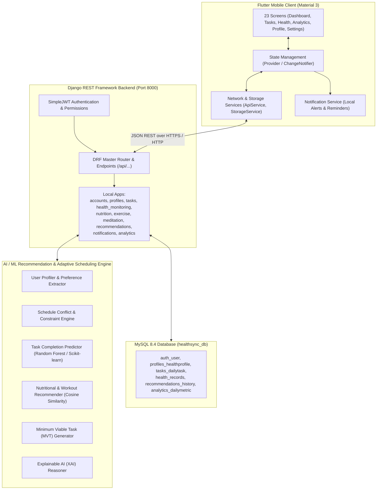
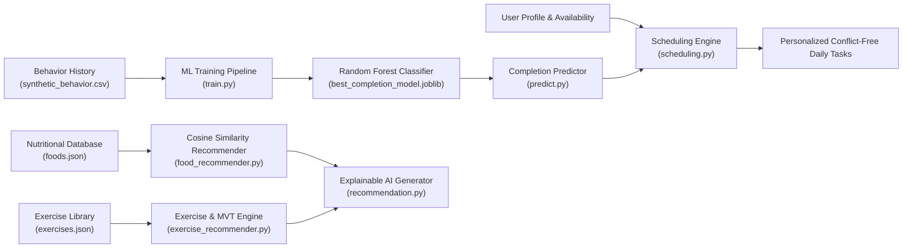

# HealthSync AI — System Architecture

**HealthSync AI – Personalized Health Monitoring, Adaptive Routine Planning and Intelligent Alert System**  
*Tagline: "A healthier day, intelligently planned around you"*

---

> [!IMPORTANT]
> **Medical Safety Disclaimer**: The application is strictly a **wellness and health habit management system**, **NOT** a medical diagnosis or treatment system. It never diagnoses diseases, prescribes medication, replaces medical professionals, or provides clinical treatment. All wellness metrics (e.g., Daily Wellness Score) and routine recommendations are non-medical habit optimizations with prominent safety disclaimers.

---

## 1. High-Level Architecture

HealthSync AI employs a modern, decoupled client-server architecture composed of four core tiers:
1. **Frontend Mobile Layer**: Cross-platform Flutter application built with Material 3 design and reactive Provider state management.
2. **Backend API Layer**: Django 6.0 & Django REST Framework (DRF) running on Python 3.13, delivering stateless REST APIs secured with JWT authentication.
3. **AI / ML Engine**: Modular Python engine (`ai_engine/`) incorporating Scikit-learn machine learning classifiers, content-based recommendation algorithms (cosine similarity), rule-based conflict resolution, and Explainable AI (XAI).
4. **Relational Database Layer**: MySQL 8.4 running with strict transaction isolation and utf8mb4 encoding for internationalized health and lifestyle logging.



---

## 2. Frontend Architecture (Flutter)

The Flutter mobile client is located under `frontend/` and follows a structured, layered design pattern:

```
frontend/lib/
├── core/
│   ├── constants/
│   │   ├── api_constants.dart      # Centralized endpoint URIs & dynamic baseUrl switcher
│   │   └── app_colors.dart         # Material 3 color system (Deep Teal, Mint, Emerald)
│   └── theme/
│       └── app_theme.dart          # Light and dark themes with Google Fonts (Inter)
├── providers/                      # Reactive state holders (ChangeNotifier)
│   ├── auth_provider.dart          # User session, JWT lifecycle, onboarding state
│   ├── profile_provider.dart       # Biometrics, baseline preferences, active goals
│   ├── task_provider.dart          # Daily schedule, task completion, rescheduling
│   ├── health_provider.dart        # Steps, active time, hydration, sleep, meditation
│   ├── recommendation_provider.dart# Food suggestions, exercise catalog, MVT generation
│   ├── analytics_provider.dart     # Daily Wellness Score, weekly trends, behavioral stats
│   └── notification_provider.dart  # Alerts feed, unread counters, mark-as-read
├── services/                       # Data persistence and HTTP networking
│   ├── api_service.dart            # HTTP client, token auto-injection, refresh interceptor
│   ├── auth_service.dart           # Authentication calls (register, login, refresh)
│   ├── storage_service.dart        # SharedPreferences wrapper for tokens and profile cache
│   └── notification_service.dart   # Local and push notifications dispatcher
└── screens/                        # 23 Screen Implementations
    ├── auth/                       # Splash, Login, Register
    ├── onboarding/                 # Intro, Personal Info, Lifestyle, Goals, Food, Exercise, Availability
    ├── dashboard/                  # Daily overview, Wellness Score ring, upcoming task, quick actions
    ├── tasks/                      # Daily schedule timeline, Task details, Rescheduling, MVT
    ├── recommendations/            # Nutrition recommendations, Workout catalog with XAI
    ├── health/                     # Hub, Hydration tracker, Sleep logger, Meditation timer
    ├── analytics/                  # Weekly adherence chart (fl_chart), pillar breakdown, AI insights
    ├── notifications/              # Alerts list, unread indicator, category filters
    ├── profile/                    # Biometrics, active goals, schedule overview
    ├── settings/                   # Medical disclaimer, API base URL configuration, logout
    └── main/                       # MainNavigationScreen (5 bottom tabs + top bar)
```

### Key Technical Capabilities:
- **Zero Linter Warnings**: Verified against Flutter 3.47 and Dart 3.13 with 0 analyzer errors and modern API conventions (`Color.withValues()`, `initialValue`, async mounted safety).
- **Offline & Token Persistence**: Auth JWT tokens and base URL configurations are saved locally via `SharedPreferences`.
- **Dynamic Server Switcher**: Configurable runtime backend URL directly in the Settings screen allowing seamless transitions between Desktop Localhost (`127.0.0.1:8000`), Android Emulator (`10.0.2.2:8000`), or LAN IP addresses.

---

## 3. Backend Architecture (Django REST Framework)

The backend is structured into modular, single-responsibility Django apps inside `backend/`:

| App | Purpose & Responsibilities |
|---|---|
| `accounts` | Custom User authentication, registration, JWT issuance and token refreshing. |
| `profiles` | Health profiles, physical biometrics (BMI), wake/sleep hours, dietary and exercise preferences, availability slots. |
| `tasks` | Daily tasks schedule, task statuses (`PENDING`, `COMPLETED`, `MISSED`, `SKIPPED`, `RESCHEDULED`), behavioral logging. |
| `health_monitoring` | Activity tracking (steps, active minutes), sleep logs, hydration intake, meals, meditation sessions. |
| `nutrition` | Food database, macronutrient breakdowns (protein, carbs, fat, calories), cuisine filters. |
| `exercise` | Exercise catalog, difficulty classifications, target durations, calorie expenditure calculations. |
| `meditation` | Mindfulness session templates (Box Breathing, Body Scan, Sleep Wind-Down). |
| `recommendations` | Interfaces with `ai_engine` to generate content-based food/workout recommendations with XAI explanations and Fallback MVTs. |
| `notifications` | User notification models, priority channels, mark-as-read endpoints. |
| `analytics` | Computes Daily Wellness Score, weekly habit adherence metrics, and behavioral analysis. |

---

## 4. AI / ML Recommendation & Adaptive Scheduling Engine

The `ai_engine/` package operates independently and is consumed by the Django backend:



1. **Task Completion Predictor**: Trained using Scikit-Learn across Logistic Regression, Decision Tree, and Random Forest models. Uses hour of day, task category, priority, user energy level, and historical adherence to output completion probabilities.
2. **Conflict Resolution & Adaptive Rescheduler**:
   - Detects overlap against work/college blocks, sleep windows, and meal periods.
   - Automatically shifts missed or rescheduled tasks into the highest-probability alternative open slot.
3. **Minimum Viable Task (MVT) Engine**:
   - When a user faces schedule pressure or fatigue, converts full routines into high-leverage 10-minute micro-habits (e.g. 10-min mobility or 5-min breathing) to prevent habit streak collapse.
4. **Explainable AI (XAI)**:
   - Accompanies every recommendation with transparent, user-understandable rationales (e.g., *"Selected because it fits your 30-minute afternoon availability and matches your vegetarian preference with optimal protein ratio"*).

---

## 5. Security & Privacy Architecture

- **Stateless JWT Authentication**: Secure Bearer tokens with 60-minute access lifetime and 7-day refresh tokens via `djangorestframework-simplejwt`.
- **User Data Isolation**: Every database query is scoped strictly to `request.user`. Users cannot view or modify another user's profile, health records, or tasks.
- **Password Security**: Standard PBKDF2 hashing with SHA-256 and minimum length/complexity enforcement.
- **CORS Protection**: Managed through `django-cors-headers` with environment-controlled origins.
- **Data Integrity**: Enforced foreign key cascading, unique constraints, and strict transaction management in MySQL 8.4.
