# HealthSync AI — Database Architecture & Schema

**Database Engine**: MySQL 8.4 Enterprise/Community  
**Database Name**: `healthsync_db`  
**Host & Port**: `127.0.0.1:3306`  
**Character Set**: `utf8mb4`  
**Collation**: `utf8mb4_unicode_ci`  
**ORM**: Django 6.0 Database Backend (`django.db.backends.mysql` via `mysqlclient`)

---

## 1. Entity-Relationship (ER) Overview

```mermaid
erDiagram
    ACCOUNTS_USER ||--|| PROFILES_HEALTHPROFILE : "has"
    ACCOUNTS_USER ||--o{ PROFILES_USERGOAL : "sets"
    ACCOUNTS_USER ||--|| PROFILES_FOODPREFERENCE : "configures"
    ACCOUNTS_USER ||--|| PROFILES_EXERCISEPREFERENCE : "configures"
    ACCOUNTS_USER ||--o{ PROFILES_DAILYAVAILABILITY : "specifies"
    ACCOUNTS_USER ||--o{ TASKS_DAILYTASK : "schedules"
    ACCOUNTS_USER ||--o{ TASKS_BEHAVIORRECORD : "logs"
    ACCOUNTS_USER ||--o{ HEALTH_ACTIVITYRECORD : "tracks"
    ACCOUNTS_USER ||--o{ HEALTH_SLEEPRECORD : "tracks"
    ACCOUNTS_USER ||--o{ HEALTH_WATERRECORD : "tracks"
    ACCOUNTS_USER ||--o{ HEALTH_MEALRECORD : "tracks"
    ACCOUNTS_USER ||--o{ HEALTH_MEDITATIONRECORD : "tracks"
    ACCOUNTS_USER ||--o{ RECOMMENDATIONS_HISTORY : "receives"
    ACCOUNTS_USER ||--o{ NOTIFICATIONS_NOTIFICATION : "receives"
    ACCOUNTS_USER ||--o{ ANALYTICS_DAILYMETRIC : "aggregates"
```

---

## 2. Table Specifications

### 2.1 Accounts & Authentication

#### `accounts_user`
Stores user credentials and core authentication identity.
| Column | Type | Constraints | Description |
|---|---|---|---|
| `id` | BIGINT | PRIMARY KEY, AUTO_INCREMENT | Unique user identifier |
| `username` | VARCHAR(150) | UNIQUE, NOT NULL | Unique account username |
| `email` | VARCHAR(254) | UNIQUE, NOT NULL | Verified user email address |
| `password` | VARCHAR(128) | NOT NULL | PBKDF2 SHA-256 hashed password string |
| `first_name` | VARCHAR(150) | NULL | User given name |
| `last_name` | VARCHAR(150) | NULL | User surname |
| `is_active` | BOOLEAN | NOT NULL, DEFAULT 1 | Whether account is active |
| `is_staff` | BOOLEAN | NOT NULL, DEFAULT 0 | Admin portal access |
| `date_joined` | DATETIME | NOT NULL | Timestamp of account registration |

---

### 2.2 Profiles & Preferences

#### `profiles_healthprofile`
Maintains user biometrics, wake/sleep hours, and baseline activity parameters.
| Column | Type | Constraints | Description |
|---|---|---|---|
| `id` | BIGINT | PRIMARY KEY, AUTO_INCREMENT | Profile record ID |
| `user_id` | BIGINT | UNIQUE, FK -> `accounts_user.id`, CASCADE | One-to-one user reference |
| `age` | INT | NOT NULL, CHECK (age > 0) | User age in years |
| `gender` | VARCHAR(20) | NOT NULL | `MALE`, `FEMALE`, `OTHER`, `PREFER_NOT_TO_SAY` |
| `height_cm` | DECIMAL(5, 2) | NOT NULL | Height in centimeters |
| `weight_kg` | DECIMAL(5, 2) | NOT NULL | Weight in kilograms |
| `bmi` | DECIMAL(4, 1) | NOT NULL | Calculated Body Mass Index |
| `activity_level` | VARCHAR(30) | NOT NULL | `SEDENTARY`, `LIGHTLY_ACTIVE`, `MODERATELY_ACTIVE`, `VERY_ACTIVE` |
| `wake_up_time` | TIME | NOT NULL | Standard morning wake-up time |
| `sleep_time` | TIME | NOT NULL | Standard evening bedtime |
| `work_start_time`| TIME | NOT NULL | Start of work/college focus hours |
| `work_end_time` | TIME | NOT NULL | End of work/college focus hours |
| `is_onboarded` | BOOLEAN | NOT NULL, DEFAULT 0 | Completion status of onboarding wizard |
| `updated_at` | DATETIME | NOT NULL | Last modification timestamp |

#### `profiles_usergoal`
Active wellness targets chosen by the user.
| Column | Type | Constraints | Description |
|---|---|---|---|
| `id` | BIGINT | PRIMARY KEY, AUTO_INCREMENT | Goal record ID |
| `user_id` | BIGINT | FK -> `accounts_user.id`, CASCADE | User reference |
| `goal_type` | VARCHAR(50) | NOT NULL | `FITNESS`, `NUTRITION`, `HYDRATION`, `SLEEP`, `MINDFULNESS` |
| `target_value`| VARCHAR(100)| NOT NULL | e.g. "8000 steps", "2500 ml", "8 hours" |
| `is_active` | BOOLEAN | NOT NULL, DEFAULT 1 | Whether goal is actively being pursued |

#### `profiles_foodpreference`
Dietary constraints and cuisine preferences for content-based nutrition filtering.
| Column | Type | Constraints | Description |
|---|---|---|---|
| `id` | BIGINT | PRIMARY KEY, AUTO_INCREMENT | Preference record ID |
| `user_id` | BIGINT | UNIQUE, FK -> `accounts_user.id`, CASCADE | One-to-one user reference |
| `diet_type` | VARCHAR(30) | NOT NULL | `VEGETARIAN`, `NON_VEGETARIAN`, `VEGAN`, `EGGETARIAN`, `KETO` |
| `allergies` | VARCHAR(255) | DEFAULT 'None' | Known food allergies or dislikes |
| `cuisine` | VARCHAR(50) | DEFAULT 'Indian' | Preferred cuisine type |

#### `profiles_exercisepreference`
Workout preferences and preferred duration per session.
| Column | Type | Constraints | Description |
|---|---|---|---|
| `id` | BIGINT | PRIMARY KEY, AUTO_INCREMENT | Preference record ID |
| `user_id` | BIGINT | UNIQUE, FK -> `accounts_user.id`, CASCADE | One-to-one user reference |
| `preferred_types` | VARCHAR(255) | NOT NULL | Comma-separated: `Walking, Yoga, Strength` |
| `preferred_duration_minutes` | INT | NOT NULL, DEFAULT 30 | Preferred duration in minutes |
| `fitness_level` | VARCHAR(30) | NOT NULL, DEFAULT 'BEGINNER' | `BEGINNER`, `INTERMEDIATE`, `ADVANCED` |

---

### 2.3 Tasks & Behavior Analytics

#### `tasks_dailytask`
The scheduled daily routine items generated for the user.
| Column | Type | Constraints | Description |
|---|---|---|---|
| `id` | BIGINT | PRIMARY KEY, AUTO_INCREMENT | Task identifier |
| `user_id` | BIGINT | FK -> `accounts_user.id`, CASCADE | User reference |
| `title` | VARCHAR(200) | NOT NULL | Task title (e.g. "Morning Sunlight Walk") |
| `category` | VARCHAR(50) | NOT NULL | `EXERCISE`, `MEAL`, `SLEEP`, `MEDITATION`, `HYDRATION`, `GENERAL` |
| `priority` | VARCHAR(20) | NOT NULL, DEFAULT 'MEDIUM' | `HIGH`, `MEDIUM`, `LOW` |
| `date` | DATE | NOT NULL, INDEX | Scheduled date |
| `scheduled_start` | TIME | NOT NULL | Start time of routine slot |
| `scheduled_end` | TIME | NOT NULL | End time of routine slot |
| `duration_minutes` | INT | NOT NULL | Duration of slot in minutes |
| `status` | VARCHAR(20) | NOT NULL, DEFAULT 'PENDING' | `PENDING`, `COMPLETED`, `MISSED`, `SKIPPED`, `RESCHEDULED` |
| `is_mvt` | BOOLEAN | NOT NULL, DEFAULT 0 | True if generated as Minimum Viable Task |
| `notes` | TEXT | NULL | Contextual instructions or XAI justification |

#### `tasks_behaviorrecord`
Historical completion records feeding the Scikit-learn predictive classifier.
| Column | Type | Constraints | Description |
|---|---|---|---|
| `id` | BIGINT | PRIMARY KEY, AUTO_INCREMENT | Record identifier |
| `user_id` | BIGINT | FK -> `accounts_user.id`, CASCADE | User reference |
| `task_category` | VARCHAR(50) | NOT NULL | Category of the task |
| `scheduled_hour`| INT | NOT NULL | Hour slot (0-23) |
| `completed` | BOOLEAN | NOT NULL | Whether the task was completed |
| `timestamp` | DATETIME | NOT NULL, INDEX | When completion event occurred |

---

### 2.4 Health Monitoring Logs

- `health_monitoring_activityrecord`: Stores daily steps, active minutes, and exercise minutes.
- `health_monitoring_sleeprecord`: Stores sleep duration (hours), bedtime, wake time, and subjective quality rating (1-5).
- `health_monitoring_waterrecord`: Stores hydration logs with quantity (ml) and cumulative daily intake.
- `health_monitoring_mealrecord`: Stores logged meals, meal type (`BREAKFAST`, `LUNCH`, `DINNER`, `SNACK`), and calories.
- `health_monitoring_meditationrecord`: Stores completed mindfulness sessions, type (`BREATHING`, `MINDFULNESS`), and duration in minutes.

---

### 2.5 Analytics & Scoring

#### `analytics_dailymetric`
Aggregates end-of-day health performance and the composite Daily Wellness Score.
| Column | Type | Constraints | Description |
|---|---|---|---|
| `id` | BIGINT | PRIMARY KEY, AUTO_INCREMENT | Metric identifier |
| `user_id` | BIGINT | FK -> `accounts_user.id`, CASCADE | User reference |
| `date` | DATE | NOT NULL, INDEX | Metric date |
| `wellness_score` | DECIMAL(5, 2)| NOT NULL | Daily Wellness Score (0.0 to 100.0) |
| `task_adherence_rate`| DECIMAL(4, 3)| NOT NULL | Ratio of completed routine tasks |
| `water_adherence_rate`| DECIMAL(4, 3)| NOT NULL | Ratio of hydration goal attained |
| `sleep_score` | DECIMAL(4, 3)| NOT NULL | Quality and consistency score |

---

## 3. Database Indexes & Performance Optimization

1. **Composite Indexes**:
   - `(user_id, date)` on `tasks_dailytask` and `analytics_dailymetric` ensures instant retrieval of today's routine and score without full table scans.
   - `(user_id, is_read)` on `notifications_notification` optimizes unread counter queries.
2. **Foreign Key Cascades**:
   - All child tables reference `accounts_user(id)` with `ON DELETE CASCADE` ensuring complete data cleanup upon account deletion.
3. **Transaction Isolation**:
   - MySQL default `REPEATABLE READ` transaction isolation ensures ACID guarantees during routine batch generation and rescheduling.
